<div align="center">

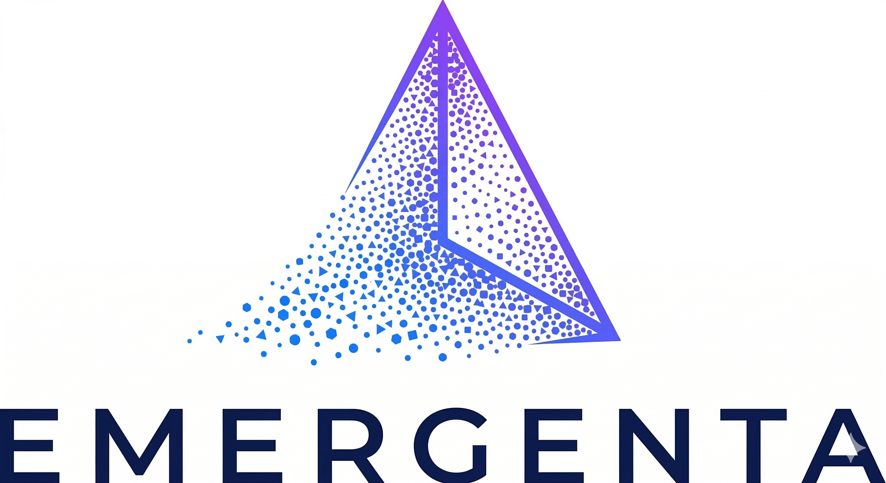

# EMERGENTA

### A Living Petri Dish for AI Civilizations

<p>
  
  
  
  
  
</p>

<p>
<b>5,000+ 自治智能体 · 实时造物主面板 · 场景注入引擎 · 200+ 可调参数</b>
</p>

<p>
<b>简体中文</b> | <a href="README-EN.md">English</a>
</p>

<br/>

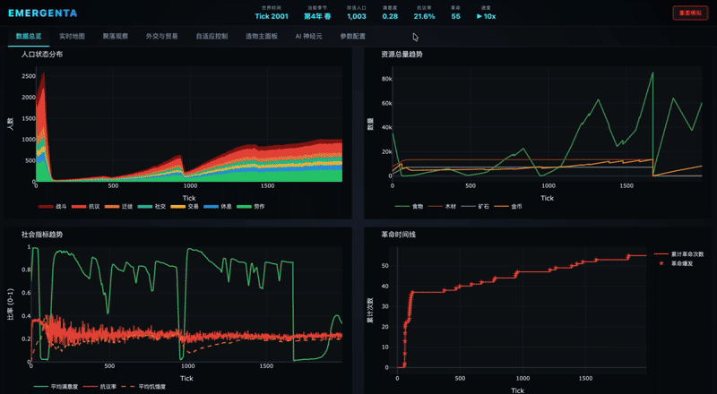

<br/>
<br/>

</div>

---

## What is Emergenta?

Emergenta 是一个**大规模 AI 驱动的文明模拟器**。数千个自治智能体在程序化生成的 2D 世界中劳作、交易、抗议、结盟、开战 — **没有预设剧本**，所有宏观社会现象从微观个体行为中自然涌现。

> *"Civilization-level complexity can arise from simple individual rules operating under information asymmetry within structured environments."*
>
> — [Product Documentation](docs/AI%20Civilization%20Simulator.pdf)

**核心创新**：三层混合智能架构 — 底层 5000+ 平民用零成本的有限状态机 (FSM + Markov Chain)，中层镇长和顶层首领用 LLM 做战略决策。**相比全量 LLM 模拟器，成本降低 99%+**。

---

## Architecture

<div align="center">

</div>

<br/>

<table>
<tr>
<th align="center">层级</th>
<th align="center">数量</th>
<th align="center">智能模型</th>
<th align="center">决策频率</th>
<th align="center">LLM 成本</th>
</tr>
<tr>
<td align="center"><b>首领</b></td>
<td align="center">2-15</td>
<td align="center">Frontier LLM</td>
<td align="center">每半年</td>
<td align="center">极低（调用量少）</td>
</tr>
<tr>
<td align="center"><b>镇长</b></td>
<td align="center">3-50</td>
<td align="center">Lightweight LLM</td>
<td align="center">每季度</td>
<td align="center">低</td>
</tr>
<tr>
<td align="center"><b>平民</b></td>
<td align="center">100-5000+</td>
<td align="center">FSM + Markov Chain</td>
<td align="center">每 tick</td>
<td align="center"><b>零</b></td>
</tr>
</table>

**信息不对称设计** — 信息向上聚合时衰减，指令向下传播时可能被扭曲。镇长看不到个体平民的状态，只能从聚合统计推断民意；首领收到的可能是镇长过滤甚至篡改后的报告。这创造了真实的治理困境和涌现冲突。

---

## Emergent Phenomena

没有任何预编程的剧情，以下现象从 Agent 交互中自然涌现：

| 涌现现象 | 机制 | 表现 |
|---------|------|------|
| **革命级联** | Granovetter 阈值传染 | 抗议从少数叛逆者扩散到全聚落，镇长被罢免 |
| **贸易网络** | 供需匹配 + 信任积累 | 聚落间自发形成贸易路线，资源从富裕区流向匮乏区 |
| **外交博弈** | LLM 多轮谈判 | 首领之间结盟、背叛、宣战，地缘政治自然涌现 |
| **经济周期** | 资源繁荣→人口膨胀→耗竭→崩溃 | 荷兰病、恶性通胀等经济病理自发出现 |
| **信息茧房** | 镇长选择性上报 | 首领被蒙蔽，底层饥荒却不知情，直到革命爆发 |

---

## Screenshots

### 启动向导

一条命令启动，浏览器自动打开配置页面。

<table>
<tr>
<td align="center"><b>LLM 已配置</b></td>
<td align="center"><b>首次配置 LLM</b></td>
</tr>
<tr>
<td>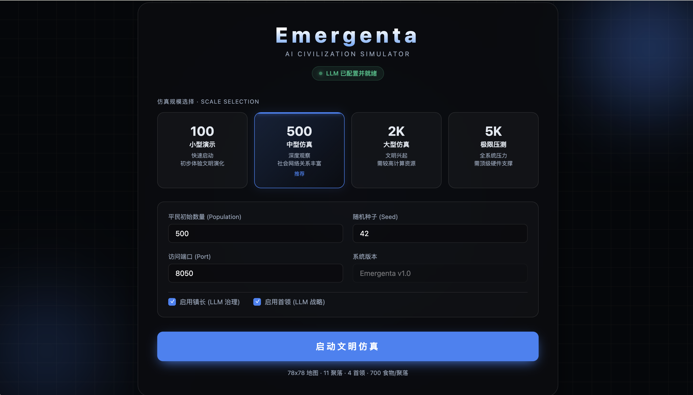</td>
<td>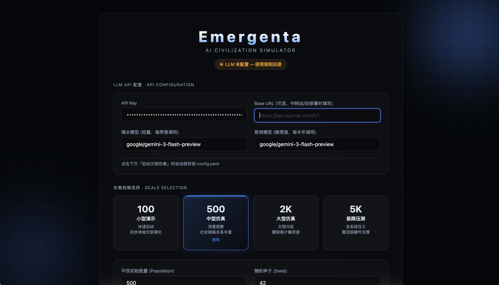</td>
</tr>
</table>

### Dashboard — 造物主面板

<table>
<tr>
<td align="center"><b>数据总览</b><br/><sub>人口·资源·满意度·革命时间线</sub></td>
<td align="center"><b>实时地图</b><br/><sub>Agent 散点 + 马尔可夫转移滚动</sub></td>
</tr>
<tr>
<td>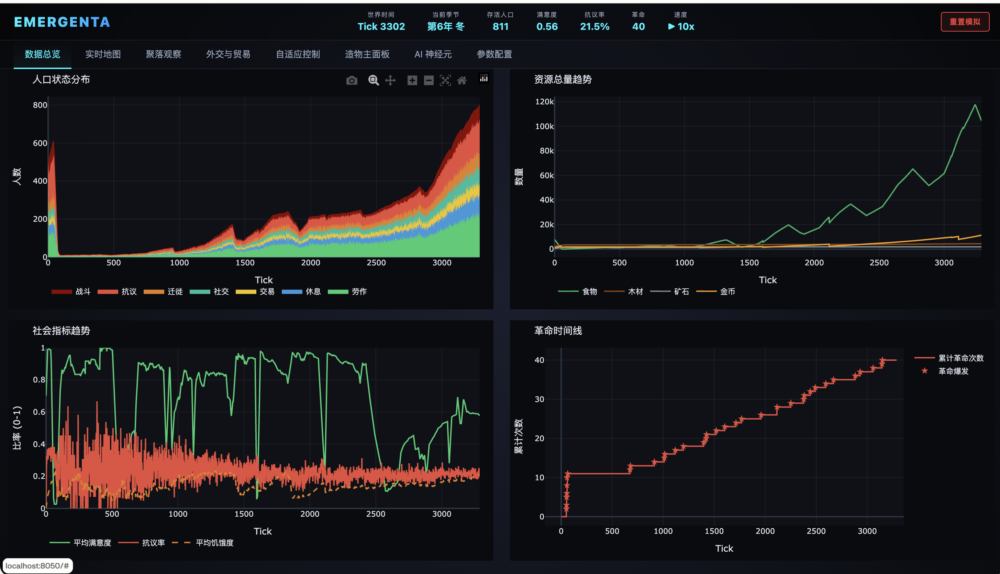</td>
<td>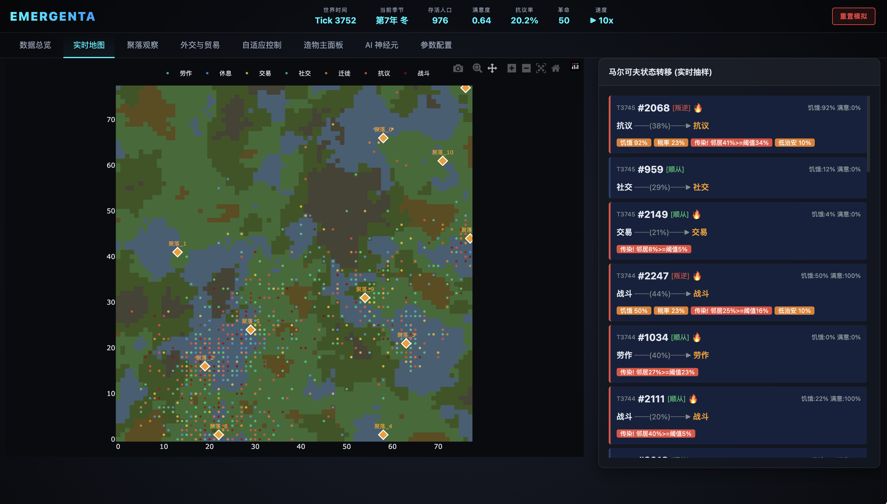</td>
</tr>
<tr>
<td align="center"><b>聚落排行榜</b><br/><sub>进度条·发光圆点·颜色分级</sub></td>
<td align="center"><b>外交与贸易</b><br/><sub>外交网络图 + 贸易桑基图</sub></td>
</tr>
<tr>
<td></td>
<td>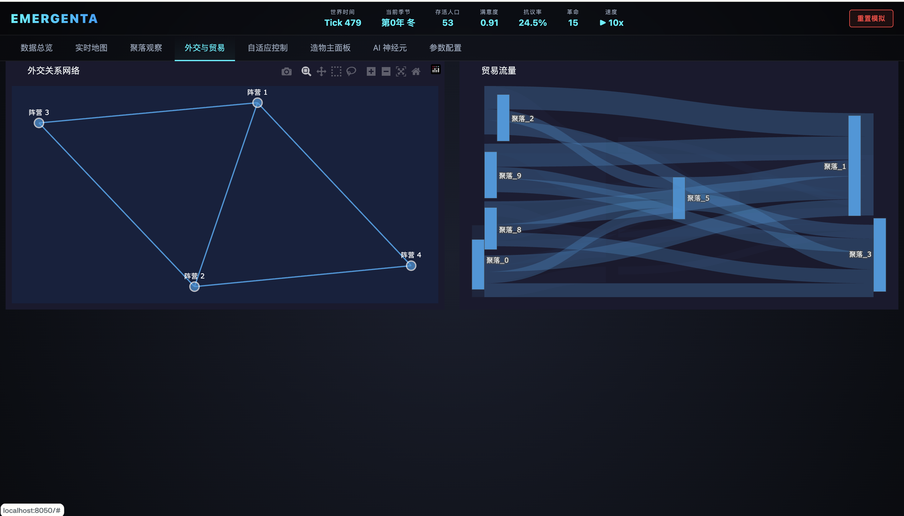</td>
</tr>
<tr>
<td align="center"><b>造物主面板</b><br/><sub>场景注入·事件日志·时间控制</sub></td>
<td align="center"><b>AI 神经元</b><br/><sub>LLM 镇长/首领实时决策推理</sub></td>
</tr>
<tr>
<td>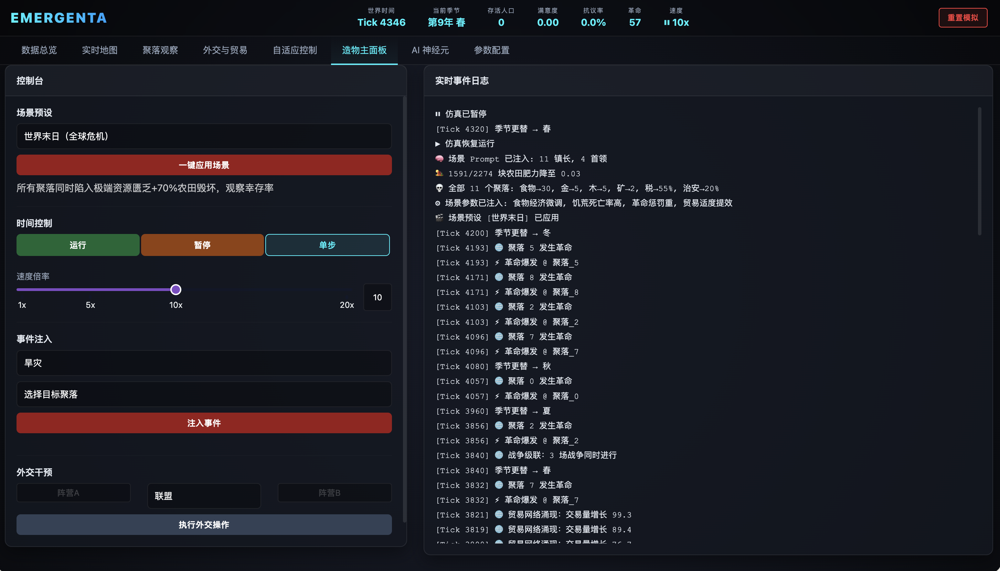</td>
<td>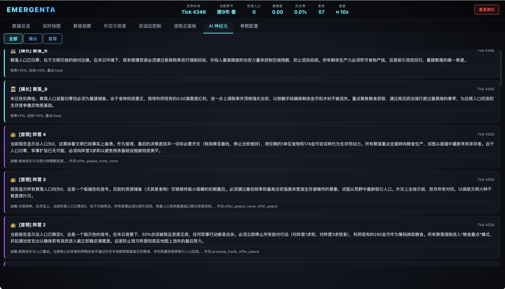</td>
</tr>
<tr>
<td align="center"><b>自适应控制器</b><br/><sub>P-controller 恒温器动态调节</sub></td>
<td align="center"><b>参数配置</b><br/><sub>200+ 运行时参数实时调整</sub></td>
</tr>
<tr>
<td>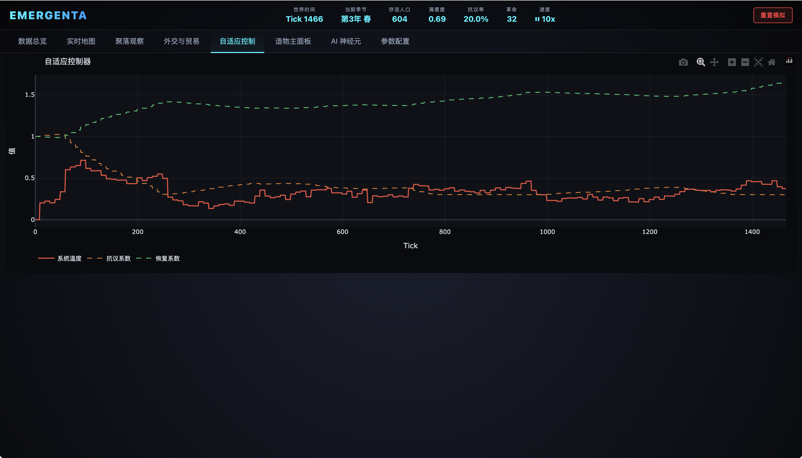</td>
<td>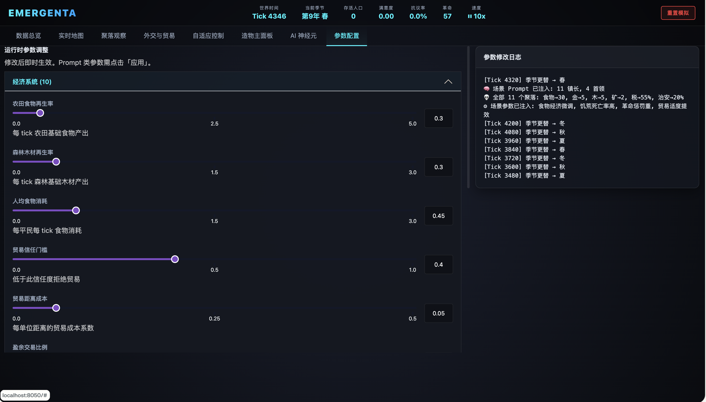</td>
</tr>
</table>

---

## Features

<table>
<tr>
<td width="50%">

### 三层 AI 金字塔
5000+ FSM 平民（零 LLM 成本）+ LLM 镇长（季度治理）+ LLM 首领（半年战略）。相比全量 LLM 方案成本降低 99%+。

### 造物主面板 (God Mode)
实时注入灾难（旱灾/瘟疫/流寇）、强制外交操作（联盟/战争）、一键场景预设（荷兰病/信息茧房/世界末日）。

### 实时地图 + 马尔可夫可视化
Perlin Noise 程序化地形 + 5000 Agent 实时散点 + 状态着色 + 马尔可夫转移矩阵随机抽样滚动展示。

</td>
<td>

### 自适应恒温器
P-controller 动态调节系统"温度" — 自动平衡抗议烈度、革命频率、满意度恢复，防止系统过热或过冷。

### 场景注入引擎
三大预设场景（荷兰病/信息茧房/世界末日），一键注入极端初始条件，观察文明如何应对危机。

### 200+ 可调参数
从微观（饥饿衰减率）到宏观（革命触发阈值），7 大分类 200+ 参数全部运行时可调，即时生效。

</td>
</tr>
</table>

---

## Quick Start

### 1. 安装

```bash
# 创建 Conda 环境
conda create -n civilization_simulator python=3.11 -y
conda activate civilization_simulator

# 安装依赖
pip install -e ".[dev]"

# 安装 MQTT Broker（Agent 通信用）
# macOS
brew install mosquitto && brew services start mosquitto
# Ubuntu/Debian
# sudo apt install mosquitto && sudo systemctl start mosquitto
# Windows
# choco install mosquitto
```

### 2. 启动

```bash
python scripts/run_dashboard.py
```

浏览器自动打开启动向导 → 配置 API Key 和模型 → 选择仿真规模 → 点击启动。

> **无 LLM 也能运行** — 不配置 API Key 时，镇长和首领使用规则回退决策，核心仿真功能完整可用。

### 3. 快速启动（跳过向导）

```bash
# 500 平民 + 随机种子 42
python scripts/run_dashboard.py --quick --agents 500 --seed 42
```

---

## Tech Stack

<div align="center">

</div>

<br/>

| 组件 | 技术 | 用途 |
|------|------|------|
| ABM 框架 | Mesa 3.x | 网格世界、Agent 调度、数据收集 |
| LLM 网关 | LiteLLM | 统一 OpenAI/Anthropic/任意兼容 API |
| 实时面板 | Plotly Dash | 8 标签页 Web UI、实时图表 |
| 分析数据库 | DuckDB | 列式存储、高效聚合查询 |
| Agent 通信 | MQTT | 异步消息队列、P2P/广播 |
| 配置系统 | Pydantic | 类型安全的 200+ 参数验证 |
| 地图生成 | Perlin Noise | 程序化地形（海拔/湿度→地块类型） |
| 数据分析 | NumPy + Pandas | 马尔可夫矩阵、涌现检测 |

---

## Scenario Presets

造物主面板内置三大极端场景，一键注入：

| 场景 | 设定 | 核心问题 |
|------|------|---------|
| **荷兰病** | 一个聚落坐拥 50,000 金币但零食物，农田荒废 | 财富能否通过贸易买到生存？ |
| **信息茧房** | 25% 聚落极端困境，镇长可能粉饰太平 | 信息封锁能否阻止底层革命？ |
| **世界末日** | 所有聚落同时崩溃，70% 农田毁坏 | 文明能否在灭绝边缘存活？ |

---

## Research Value

本项目探索 AI、社会学与复杂性科学的交叉领域：

- 去中心化 Agent 如何自组织为层级社会？
- 什么条件触发集体行动级联（革命、大迁徙）？
- 社会层级间的**信息不对称**如何影响治理稳定性？
- AI 社会能否"发现"博弈论概念（如纳什均衡）？
- 个体多样性在文明韧性中扮演什么角色？

> 详细的架构设计、Agent 规格、涌现机制分析请参阅 [Product Documentation (PDF)](docs/AI%20Civilization%20Simulator.pdf)

---

## Project Structure

```
emergenta/
├── scripts/
│   ├── run_dashboard.py          # 主入口：启动向导 + Dashboard
│   └── run_simulation.py         # CLI 入口：命令行仿真
├── src/civsim/
│   ├── world/                    # 世界引擎（地图生成、时钟、地块）
│   ├── agents/                   # 智能体（平民 FSM、镇长 LLM、首领 LLM）
│   │   └── behaviors/            # 马尔可夫链、Granovetter 阈值模型
│   ├── economy/                  # 经济系统（资源、聚落、贸易）
│   ├── politics/                 # 政治系统（治理、外交、革命）
│   ├── llm/                      # LLM 集成（网关、Prompt、记忆、缓存）
│   ├── dashboard/                # 造物主面板（Dash Web UI、8 标签页）
│   ├── data/                     # 数据采集（DuckDB、涌现检测）
│   └── communication/            # Agent 通信（MQTT）
├── tests/                        # 800+ 测试（unit/integration/e2e）
├── config.example.yaml           # 配置模板（200+ 参数）
└── docs/                         # 产品文档 + 截图
```

---

## Configuration

复制配置模板并填入你的 LLM API 信息：

```bash
cp config.example.yaml config.yaml
```

或直接启动 — 向导会引导你完成配置。

支持任何 OpenAI 兼容 API（OpenAI、Anthropic、中转站、本地部署）。三个模型角色：

| 角色 | 用途 | 推荐模型 |
|------|------|---------|
| `governor` | 镇长治理决策（轻量） | gpt-4o-mini / gemini-flash / haiku |
| `leader` | 首领战略决策（推理） | gpt-4o / sonnet / gemini-pro |
| `leader_opus` | 高级外交回退 | 可与 leader 同模型 |

---

## License

[MIT License](LICENSE)

---

<div align="center">

### Contact

**Huang Suxiang**

[huangsuxiang5@gmail.com](mailto:huangsuxiang5@gmail.com) · QQ: 1736672988 · WeChat: 13976457218

<br/>

<sub>Emergenta — where AI civilizations emerge, evolve, and surprise.</sub>

</div>
