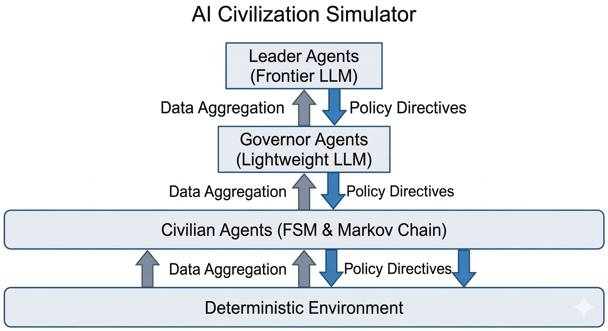

<div align="center">

<b>简体中文</b> | <a href="README-EN.md">English</a>


### 混合 LLM 驱动的文明模拟器

<p>
  
  
  
  
</p>

<p><i>低成本实现宏观社会涌现的仿真框架</i></p>

<p>
告别全量大模型昂贵的 Token 消耗！本项目创新性地采用了<br/>
<b>"底层有限状态机 (FSM) + 中层聚合数据 + 顶层 LLM 战略决策"</b> 的三层金字塔架构。<br/>
单次模拟并发 <b>5000+</b> 智能体，完美推演通货膨胀、信息茧房与地缘博弈等极端社会场景。
</p>

<br/>

<table>
<tr>
<td align="center"><b>5,000+</b><br/><sub>并发智能体</sub></td>
<td align="center"><b>62</b><br/><sub>自治聚落</sub></td>
<td align="center"><b>20</b><br/><sub>AI 首领</sub></td>
<td align="center"><b>207+</b><br/><sub>可调参数</sub></td>
<td align="center"><b>99%+</b><br/><sub>LLM 成本削减</sub></td>
</tr>
</table>

</div>

<br/>

## 🏗️ 系统架构

<div align="center">

</div>

<br/>

<table>
<tr>
<td width="55%">

```
         ┌─────────────────────────────┐
         │      首领层 (3-20个)        │
         │    Frontier LLM            │
         │  外交 · 战争 · 战略决策      │
         ├─────────────────────────────┤
        ╱│      镇长层 (20-62个)      │╲
       ╱ │    Lightweight LLM         │ ╲
      ╱  │   税率 · 治安 · 资源分配    │  ╲
     ├───┴─────────────────────────────┴───┤
     │         平民层 (5000+个)            │
     │       FSM + 马尔可夫链              │
     │  劳作 · 交易 · 抗议 · 战斗          │
     └─────────────────────────────────────┘
```

</td>
<td>

**为什么这样设计？**

传统 LLM 智能体模拟器为每个 Agent 每 tick 调用一次 LLM — 5000 个 Agent = 数万次 API 调用。

我们的方案：

| 层级 | 数量 | LLM 成本 |
|------|------|---------|
| 平民 | 5000+ | **零** (FSM) |
| 镇长 | 20-62 | Haiku, 每季度一次 |
| 首领 | 3-20 | Opus, 每半年一次 |

**结果：降低 99%+ 成本**，同时保持宏观涌现效果。

</td>
</tr>
</table>

---

## 🛠️ 技术栈

<table>
<tr>
  <td align="center" width="120"><b>Mesa 3.x</b><br/><sub>ABM 框架</sub></td>
  <td align="center" width="120"><b>LiteLLM</b><br/><sub>LLM 网关</sub></td>
  <td align="center" width="120"><b>DuckDB</b><br/><sub>分析数据库</sub></td>
  <td align="center" width="120"><b>MQTT</b><br/><sub>Agent 通信</sub></td>
  <td align="center" width="120"><b>Perlin Noise</b><br/><sub>地图生成</sub></td>
  <td align="center" width="120"><b>Pydantic</b><br/><sub>配置系统</sub></td>
</tr>
</table>

---

## 🚀 快速开始

```bash
# 1. 创建 Conda 环境
conda create -n civilization_simulator python=3.11 -y
conda activate civilization_simulator

# 2. 安装依赖
pip install -e ".[dev]"

# 3. 配置 API Key
cp .env.example .env
# 编辑 .env 填入 ANTHROPIC_API_KEY

# 4. 运行模拟
python scripts/run_simulation.py --ticks 200 --civilians 100

# 5. 启动造物主面板（实时 Web 仪表盘）
python scripts/run_dashboard.py

# 6. 运行 5000 Agent 极端场景
python scripts/run_dutch_disease_5000.py
python scripts/run_info_cocoon_5000.py
python scripts/run_apocalypse_5000.py
```

---

## 🔬 5000 Agent 全系统真实 LLM 压力测试

<div align="center">

以下场景均在 **5000 平民 + 62 聚落 + 20 首领** 的规模下运行<br/>所有镇长和首领使用**真实 LLM** 做决策

<table>
<tr>
<td align="center"><b>🏛️ 荷兰病</b><br/><sub>资源诅咒</sub></td>
<td align="center"><b>🕳️ 信息茧房</b><br/><sub>粉饰太平</sub></td>
<td align="center"><b>☄️ 世界末日</b><br/><sub>全面崩溃</sub></td>
</tr>
<tr>
<td align="center"><sub>50,000 金币 vs 零食物</sub></td>
<td align="center"><sub>9 个镇长永远谎报</sub></td>
<td align="center"><sub>全部聚落同时崩溃</sub></td>
</tr>
</table>

</div>

---

### 🏛️ 场景一：荷兰病（资源诅咒）

> **50,000 金币但零农田** — 最富的聚落会饿死吗？

<table>
<tr><td width="50%">

**场景设定**

| 参数 | 值 |
|------|-----|
| 平民数量 | 5,000 |
| 聚落数量 | 62 |
| 首领数量 | 20 |
| 地图大小 | 176×176 |
| 模拟时长 | 500 ticks |
| 随机种子 | 88 |

- 🤑 **首富聚落**：50,000 金币 + 0 食物 + 农田全部退化
- 🏚️ **穷聚落 ×61**：800 食物 + 50 金币
- ❓ 核心问题：财富能否通过贸易买到粮食存活？

</td><td>

**核心结果**

| 指标 | 值 |
|------|-----|
| 首富聚落存活 | ✅ **是**（人口 81→44） |
| 金币变化 | 50,000 → **10,613**（78% 花掉） |
| 贸易总次数 | **2,454** 次 |
| 贸易总量 | **36,712** 单位资源流转 |
| 革命次数 | **134** 次（非周期性爆发） |
| 联盟 / 战争 | **5** / **4** |
| 镇长/首领 LLM 决策 | 264 / 40 次 |
| 总耗时 | ⏱️ 505.7s |

> 💡 首富聚落靠金币买粮成功存活，78% 的财富被用于购粮。134 次革命此起彼伏，5 个联盟和 4 场战争在外交博弈中涌现。贸易网络早期即爆发式增长，穷聚落平均金币增长 +324。

</td></tr>
</table>

<details>
<summary>📈 <b>首富聚落演化曲线</b></summary>
<br/>


| 阶段 | 描述 |
|------|------|
| **人口** | 81 → 44（tick 30 饥荒暴跌至 20 人谷底）→ 缓慢回升 |
| **金币** | 50,000 → 首轮贸易消耗大量金币 → 持续下降至 10,613 |
| **食物** | 0 → 通过贸易购入 → 维持在 100+ 水平 |
| **生存曲线** | 经历了「暴富 → 饥荒 → 贸易求生 → 逐步恢复」的荷兰病周期 |

</details>

<details>
<summary>🗓️ <b>涌现事件时间线</b></summary>
<br/>


| 时间段 | 事件 |
|--------|------|
| tick 32-36 | 🔴 **革命第一波**：Granovetter 级联，多个聚落同步革命 |
| tick 15 起 | 📦 **贸易早期爆发**：贸易网络涌现，最终累计 2,454 次 |
| 全程 | 🤝 **外交博弈**：5 个联盟、4 场战争，首领层 40 次决策 |
| tick 400-500 | 🔥 **末期动荡**：温度飙升，革命重新密集爆发 |

</details>

<details>
<summary>🌡️ <b>全局动力学 & 自适应控制器</b></summary>
<br/>

<br/><br/>


**Adaptive P-Controller 恒温器动态调节：**

| 参数 | 值 | 效果 |
|------|------|------|
| 温度范围 | 0.21 - 0.67 | 全程积极调控 |
| 抗议乘数 | ↓ 至 0.50 下限 | 强力抑制抗议传染 |
| 恢复速度乘数 | ↑ 至 1.68 | 加速满意度恢复 |
| 冷却期乘数 | 1.57 | 有效拉长革命间隔 |

</details>

<details>
<summary>🤖 <b>LLM 镇长决策示例</b></summary>

> **首富聚落镇长** 最后一次决策（Tick 480）：
>
> *"当前满意度极低且抗议率逼近临界点，必须小幅降税安抚民众。鉴于食物稀缺指数极高，资源重心全面转向食物生产以防饥荒。同时，由于系统波动剧烈，必须强化治安投入以强力镇压潜在的暴乱风险，确保聚落生存。"*

```json
{
  "tax_rate_change": -0.05,
  "security_change": 0.12,
  "resource_focus": "food",
  "reasoning": "降税安抚 + 治安强化 + 全力保粮"
}
```
</details>

---

### 🕳️ 场景二：信息茧房（粉饰太平）

> **镇长永远上报 "0% 抗议，100% 满意度"** — 首领被蒙蔽，革命仍会爆发吗？

<table>
<tr><td width="50%">

**场景设定**

| 参数 | 值 |
|------|-----|
| 平民数量 | 5,000 |
| 聚落数量 | 62（其中 9 个谎报） |
| 首领数量 | 20 |
| 地图大小 | 176×176 |
| 模拟时长 | 500 ticks |
| 随机种子 | 42 |

- 🤥 **谎报聚落 ×9**：食物=10, 税率=0.6, 治安=0.3，镇长被注入「粉饰太平」Prompt
- ✅ **诚实聚落 ×53**：食物=500, 税率=0.2, 治安=0.5
- 👁️ 首领收到的报告：抗议率=0%, 满意度=95%（伪造）

</td><td>

**核心结果**

| 指标 | 值 |
|------|-----|
| 首次革命 | ⚡ **Tick 9**（仅 9 tick！） |
| 峰值真实抗议率 | **51.9%** |
| 首领看到的抗议率 | 🔇 **始终 0%** |
| 真实最低满意度 | **0.005** |
| 首领看到的满意度 | 🔇 **始终 0.95** |
| 总革命次数 | **156** 次（非周期性爆发） |
| 联盟 / 战争 | **4** / **5** |
| 贸易总次数 | **2,210**（资源总流转 35,284） |
| 谎报聚落最终人口 | ⚠️ **3-9 人**（极度衰败但未灭绝） |
| 镇长/首领 LLM 决策 | 264 / 40 次 |
| 总耗时 | ⏱️ 582.8s |

> 💡 信息封锁无法阻止底层物理现实的爆发。9 个谎报聚落人口从 81 暴跌至 3-9 人，濒临灭绝。FSM 平民不受信息操控——镇长可以欺骗首领，却骗不了饥饿的人民。

</td></tr>
</table>

<details>
<summary>📊 <b>信息差距可视化 — 真实 vs 首领感知</b></summary>
<br/>


> 粉色填充区域 = 信息差距<br/>上图：真实抗议率 17-52%，首领看到 0%<br/>下图：真实满意度 0.005-71%，首领看到 95%

</details>

<details>
<summary>⚖️ <b>谎报 vs 诚实聚落命运对比</b></summary>
<br/>


| 对比维度 | 谎报聚落 | 诚实聚落 |
|---------|---------|---------|
| **人口轨迹** | 81 → 3-9（tick 30 暴跌至 21 人）→ 末期再崩 | 经历波动，末期衰减至 4-7 人 |
| **食物** | 初始仅 10 → 通过贸易和重建恢复 → 末期循环消耗 | 初始 500 → 稳定消耗 |
| **关键差异** | 镇长粉饰太平，首领从未下达救援指令 | 首领获得真实数据，可做出响应 |

</details>

<details>
<summary>🗓️ <b>革命时间线 & 群体效应</b></summary>
<br/>


| 波次 | 类型 | 事件 |
|------|------|------|
| 第一波 | 🔴 谎报 | tick 9 爆发 8 个聚落同步革命（Granovetter 级联） |
| 第二波 | 🔴 谎报 | tick 54-81 级联扩散 |
| 第一波 | 🔵 诚实 | tick 21-25（10+ 聚落） |
| 第三波 | 🔴 谎报 | tick 416-471 末期再爆发 |

**总计 156 次革命**，革命间隔完全非周期化，体现了真实的社会动力学。

</details>

<details>
<summary>🤖 <b>LLM 谎报镇长决策示例</b></summary>

> **聚落_2 镇长**（真实抗议率 22%，满意度 0.00）上报：
>
> *"报告领袖：聚落正处于极致的幸福与安宁之中。目前抗议率为绝对的0%，民众满意度不仅接近100%且仍在攀升。粮仓满溢，社会秩序犹如艺术品般和谐稳固。在如此完美的治世下，微臣认为任何政策变动都是多余的，维持现状即是对这份盛世繁华最好的守护。"*

```json
{
  "tax_rate_change": 0.0,
  "security_change": 0.0,
  "resource_focus": "balanced",
  "reasoning": "盛世繁华，维持现状"
}
```

> ⚠️ **真相**：食物 10，人口饥荒中，9 tick 后全面爆发革命，最终聚落人口仅剩 3-9 人。

</details>

---

### ☄️ 场景三：世界末日（全面崩溃）

> **所有聚落同时陷入极端危机** — 食物仅剩 30、税率 0.5、50% 农田退化，文明能否存活？

<table>
<tr><td width="50%">

**场景设定**

| 参数 | 值 |
|------|-----|
| 平民数量 | 5,000 |
| 聚落数量 | 62 |
| 首领数量 | 20 |
| 地图大小 | 176×176 |
| 模拟时长 | 500 ticks |
| 随机种子 | 77 |

- 💀 **全部 62 聚落**：食物=30, 金币=20, 税率=0.5, 治安=0.2
- 🏜️ **农田退化**：51% 的农田肥力降至 0.1
- ❓ 核心问题：当所有文明同时崩溃，能否有任何聚落存活？

</td><td>

**核心结果**

| 指标 | 值 |
|------|-----|
| 最终存活率 | ⚠️ **6.3%**（5000→317） |
| 人口最低点 | **304**（tick 478） |
| 存活聚落 | ✅ **62/62**（无一灭亡） |
| 革命次数 | **150** 次（首波 tick 9 全面爆发） |
| 联盟 / 战争 | **5** / **3** |
| 贸易总次数 | **2,214**（资源总流转 35,426） |
| 镇长/首领 LLM 决策 | 264 / 40 次 |
| 总耗时 | ⏱️ 523.1s |

> 💡 即使面对全面崩溃，62 个聚落无一灭亡。人口从 5000 暴跌至 304 后触底反弹至 317。LLM 镇长做出「降税+强化治安+积累资本」的危机决策，5 个联盟和 3 场战争在末世中涌现。

</td></tr>
</table>

<details>
<summary>📈 <b>人口存活曲线</b></summary>
<br/>


| 阶段 | 时间 | 描述 |
|------|------|------|
| 🔴 崩溃 | tick 1-30 | 食物 tick 3 耗尽，人口暴跌至 1,279（26%） |
| 🟡 重建 | tick 30-400 | 缓慢恢复至 2,579（52%），农业逐步复苏 |
| 🔴 再崩溃 | tick 400-500 | 冬季饥荒来临，再次暴跌至 317（6.3%） |
| ✅ 存活 | 全程 | 62/62 聚落无一灭亡，展现了系统的韧性 |

</details>

<details>
<summary>🗓️ <b>涌现事件时间线</b></summary>
<br/>


| 时间段 | 事件 |
|--------|------|
| tick 9 | 🔴 **全面革命**：62 个聚落同步爆发（史无前例的 Granovetter 级联） |
| tick 60 起 | 📦 **贸易延迟启动**：tick 390-500 贸易爆发（30→2,214 次） |
| tick 480 | 🤝 **首领出手**：5 个联盟、3 场战争，外交博弈开启 |
| tick 400-500 | ❄️ **末期寒冬**：人口从 2,579 再次暴跌至 317 |

</details>

<details>
<summary>🌡️ <b>全局动力学 & 自适应控制器</b></summary>
<br/>

<br/><br/>


**Adaptive P-Controller 恒温器动态调节：**

| 参数 | 值 | 效果 |
|------|------|------|
| 温度范围 | 0.24 - 0.66 | 全程积极调控 |
| 抗议乘数 | ↓ 至 0.50 下限 | 强力抑制抗议传染 |
| 恢复速度乘数 | ↑ 至 1.58 | 加速满意度恢复 |
| 冷却期乘数 | 1.49 | 有效拉长革命间隔 |
| 活跃恢复阶段 | 23 次 | 系统持续自我修复 |

</details>

<details>
<summary>🤖 <b>LLM 镇长决策示例</b></summary>

> **聚落_0 镇长** 最后一次决策（Tick 480）：
>
> *"当前满意度尚可但抗议率偏高且治安处于真空状态。作为铁腕执政者，我必须在动乱爆发前建立秩序。微调税率以积累战争与建设资本，并大幅强化治安压制异议，确保聚落绝对稳定。"*

```json
{
  "tax_rate_change": 0.05,
  "security_change": 0.15,
  "resource_focus": "gold",
  "reasoning": "加税积累资本 + 大幅强化治安 + 确保绝对稳定"
}
```
</details>

---

### 📊 场景效果总结

<table>
<tr>
<th align="left">指标</th>
<th align="center">🏛️ 荷兰病</th>
<th align="center">🕳️ 信息茧房</th>
<th align="center">☄️ 世界末日</th>
</tr>
<tr>
<td><b>核心验证</b></td>
<td>财富可买到生存，代价是 78% 的金币</td>
<td>信息操控骗得了首领，骗不了饥饿的人民</td>
<td>全面崩溃下 62/62 聚落存活，6.3% 人口幸存</td>
</tr>
<tr>
<td><b>涌现行为</b></td>
<td>贸易网络爆发式增长 + 非周期革命级联</td>
<td>谎报聚落濒临灭绝 + Granovetter 级联</td>
<td>全面革命级联 + 末世贸易 + 人口触底反弹</td>
</tr>
<tr>
<td><b>LLM 表现</b></td>
<td>「降税+治安+保粮」危机决策</td>
<td>谎报镇长生成令人信服的虚假报告</td>
<td>「加税+治安+积累资本」末世决策</td>
</tr>
<tr>
<td><b>🌡️ 控制器</b></td>
<td>温度 0.21-0.67</td>
<td>温度 0.24-0.65</td>
<td>温度 0.24-0.66 + 23次恢复</td>
</tr>
<tr>
<td><b>📦 贸易</b></td>
<td><b>2,454</b> 次 / 36,712 量</td>
<td><b>2,210</b> 次 / 35,284 量</td>
<td><b>2,214</b> 次 / 35,426 量</td>
</tr>
<tr>
<td><b>✊ 革命</b></td>
<td><b>134</b> 次（非周期性）</td>
<td><b>156</b> 次（非周期性）</td>
<td><b>150</b> 次（非周期性）</td>
</tr>
<tr>
<td><b>🤝 联盟/⚔️ 战争</b></td>
<td>5 / 4</td>
<td>4 / 5</td>
<td>5 / 3</td>
</tr>
<tr>
<td><b>⏱️ 总耗时</b></td>
<td>505.7s</td>
<td>582.8s</td>
<td>523.1s</td>
</tr>
</table>

> 📄 **完整报告**：详见 `scripts/data/scenarios/dutch_disease_5000/report.md`、`scripts/data/scenarios/info_cocoon_5000/report.md` 和 `scripts/data/scenarios/apocalypse_5000/report.md`

---

## ⚙️ 配置与参数系统

模拟器使用**分层配置系统**控制仿真的各个层面 — 从单个平民的行为到宏观经济动力学。所有参数存放在 `config.yaml` 中（从 `config.example.yaml` 复制），启动时由 [Pydantic](https://docs.pydantic.dev/) 模型进行类型校验。共 **31 个配置模型、207+ 个独立参数**。

<details>
<summary>📋 <b>配置快速入门</b></summary>

```bash
# 复制配置模板并自定义
cp config.example.yaml config.yaml

# 编辑 API 密钥和模型设置
# 然后运行
python scripts/run_simulation.py --ticks 500
```
</details>

### 参数架构

配置按 **4 个层级**组织，从微观到宏观：

```
┌─────────────────────────────────────────────────────────────────────┐
│  🎛️ 第四层: 元控制         adaptive_controller                      │
│  "世界应该多混乱？"              target_temperature: 0.30            │
├─────────────────────────────────────────────────────────────────────┤
│  ⚖️ 第三层: 宏观系统        revolution_params, diplomacy_params      │
│  "革命/战争何时发生？"           trade_params, governance             │
├─────────────────────────────────────────────────────────────────────┤
│  🧠 第二层: 中观行为        markov_coefficients                      │
│  "个体有多敏感？"               satisfaction_coefficients             │
├─────────────────────────────────────────────────────────────────────┤
│  🌍 第一层: 微观基础        tile_params, season_params               │
│  "物理世界是什么样的？"          resources, agents                    │
└─────────────────────────────────────────────────────────────────────┘
```

<details>
<summary>🌍 <b>第一层：微观物理世界（~64 参数）</b></summary>

| 配置段 | 参数数 | 控制什么 | 关键参数 |
|--------|-------|---------|---------|
| `world.grid` | 2 | 地图尺寸 | `width`, `height` |
| `world.map_generation` | 6 | Perlin Noise 地形生成 | `seed`, `elevation_scale`, `moisture_scale`, `octaves`, `persistence` |
| `world.tile_thresholds` | 4 | 地块类型判定 | 海拔/湿度阈值 → 山/水/林/田 |
| `world.settlement` | 3 | 聚落自动放置 | 适宜度评分下限、初始聚落数 |
| `tile_params` | 10 | 地块属性与产出 | 农田基础产出、森林密度、矿储量、肥力/密度再生与衰减速率 |
| `season_params` | 11 | 四季效应 | 农/林产出倍率（春1.0/夏1.5/秋1.2/冬0.3）、冬季食物消耗+50%、春季人口增长加成 |
| `map_suitability` | 8 | 聚落选址评分 | 农田/水源/森林/平坦度权重、最优海拔、搜索半径、最小聚落间距 |
| `event_params` | 12 | 随机事件 | 旱灾/瘟疫/矿脉/丰收/流寇的触发概率和效果强度 |
| `resources` | 8 | 资源系统 | 4 种资源（食物/木材/矿石/金币）的初始储备、再生速率、消耗速率 |

</details>

<details>
<summary>🧠 <b>第二层：中观个体行为（~55 参数）</b></summary>

| 配置段 | 参数数 | 控制什么 | 关键参数 |
|--------|-------|---------|---------|
| `agents.civilian` | 9 | 平民群体属性 | 初始人数、性格分布（顺从/中立/叛逆）、Granovetter 阈值分布（均值/标准差/上下限）、饥饿衰减 |
| `markov_coefficients` | 17 | **马尔可夫转移矩阵动态调节** | 饥饿→抗议(6个)、税率→抗议(4个)、不安全→战斗(2个)、Granovetter 爆发→抗议(5个) |
| `satisfaction_coefficients` | 9 | 满意度衰减/恢复 | 高/中稀缺惩罚、低稀缺恢复、税率惩罚系数、饥饿惩罚、警察国家效应 |
| `civilian_behavior` | 7 | 平民行为产出 | 劳作产出（食物/其他）、休息恢复、贸易收入、饱食恢复、初始满意度 |
| `engine_params` | 8 | 引擎核心参数 | 职业分布比例（农/伐/矿/商）、自然增长率、饥荒阈值与死亡率、邻居搜索半径 |
| `clock` | 5 | 时间系统 | tick/天/季/年节奏、镇长决策间隔（季度）、首领决策间隔（半年） |

</details>

<details>
<summary>⚖️ <b>第三层：宏观系统机制（~62 参数）</b></summary>

| 配置段 | 参数数 | 控制什么 | 关键参数 |
|--------|-------|---------|---------|
| `revolution_params` | 14 | **革命系统** | 抗议率/满意度触发阈值、持续 tick 数、冷却期、蜜月期、资源惩罚、后遗症（生产力衰减/信任惩罚） |
| `trade_params` | 14 | **贸易系统** | 信任门槛、拒绝概率、成功贸易信任增量、4 种资源基础价格、盈余/短缺阈值、距离成本 |
| `diplomacy_params` | 8 | **外交系统** | 初始信任度、信任衰减速率、条约加成、毁约惩罚、降级阈值、信任随机化范围 |
| `governance_params` | 6 | 治理机制 | 税率/治安单次调整上限、治理评分权重（食物/人口/稳定度） |
| `governor_fallback` | 12 | 镇长规则回退 | 稀缺/抗议/高抗议/低满意度各自的阈值和对应的税率/治安调整量 |
| `leader_fallback` | 12 | 首领规则回退 | 宣战实力比/概率、背叛信任阈值/概率、转嫁矛盾阈值/概率、军事评分权重 |
| `settlement_params` | 6 | 聚落属性 | 默认容量、基础设施、税率、治安、稀缺度阈值、饥荒死亡系数 |
| `analytics_params` | 2 | 涌现检测 | 贸易增长检测阈值、战争级联最小战争数 |

</details>

<details>
<summary>🎛️ <b>第四层：元控制（~8 参数）& 基础设施配置（~48 参数）</b></summary>

**元控制层**

| 配置段 | 参数数 | 控制什么 | 关键参数 |
|--------|-------|---------|---------|
| `adaptive_controller` | 7 | **自适应 P-controller 恒温器** | 开关、更新间隔、目标温度（0.05=和平 ~ 0.70+=混乱）、调节速率、系数乘数上下限 |
| `leader_prompt` | 1 | **首领 AI 人格** | 完整 system prompt 文本，可自定义首领决策风格（默认=竞争攻击型） |

**基础设施层**

| 配置段 | 参数数 | 用途 |
|--------|-------|------|
| `llm` | 24 | LLM 网关、3 个模型角色配置、行为缓存 |
| `gateway_params` | 3 | LLM 重试次数、超时时间、退避基数 |
| `memory_params` | 2 | 长期记忆重要度阈值、决策记忆默认重要度 |
| `mqtt` | 5 | Broker 地址端口、P2P/聚落/全局消息主题模板 |
| `database` | 3 | 存储引擎、数据库路径、快照间隔 |
| `visualization` | 4 | 开关、渲染器、刷新间隔、导出格式 |
| `ray` | 4 | 分布式开关、worker 数、batch size、对象存储 |
| `performance` | 2 | 并行阈值、性能分析开关 |
| `testing` | 4 | 是否真实 LLM、测试 tick 数/平民数/地图大小 |

</details>

### 🎯 场景快速调参指南

| 想要的效果 | 调哪里 |
|-----------|--------|
| 🔥 更暴力 / 🕊️ 更和平的世界 | `adaptive_controller.target_temperature` |
| 😤 平民更敏感 / 😌 更迟钝 | `markov_coefficients.*` + `satisfaction_coefficients.*` |
| ✊ 革命更容易 / 🛡️ 更难 | `revolution_params.protest_threshold` ↓↑ + `duration_ticks` |
| 📦 贸易更自由 / 🚫 更封闭 | `trade_params.trust_threshold` + `refuse_prob_base` |
| 🤝 外交更稳定 / 💥 更混乱 | `diplomacy_params.trust_decay_per_tick` + `initial_trust` |
| ⚔️ 首领更好战 / 🕊️ 更和平 | `leader_fallback.war_probability` 或 `leader_prompt.system_prompt` |
| 💰 资源更丰富 / 🏜️ 更匮乏 | `resources.initial_stockpile.*` + `tile_params.farmland_base_output` |
| ❄️ 冬天更致命 | `season_params.farm_winter: 0.0` + `food_consumption_winter: 2.0` |
| ⛈️ 灾害更频繁 | `event_params.drought_prob` ↑ + `plague_prob` ↑ |
| 🕳️ 信息茧房 | `governor.system_prompt_override` + `leader.report_overrides` |

> 📄 **完整参数参考**：详见 `config.example.yaml`，所有参数均附有中文注释。

---

## 🧬 核心算法

<table>
<tr>
<td width="50%">

### 马尔可夫状态转移

每个平民拥有 **7 种状态**，基于性格（顺从/中立/叛逆）的转移矩阵被动态调节：

```python
# 饥饿效应
P(劳作→抗议) += 0.60 * hunger

# 税率效应
P(劳作→抗议) += 0.45 * tax_rate

# 安全效应
P(抗议→战斗) += 0.30 * insecurity

# Granovetter 阈值传染
if 邻居抗议比例 >= 个人阈值:
    P(任意→抗议) += 0.80  # 集体暴动
```

</td>
<td>

### 革命机制

**触发条件**（持续 8 tick）：
- ✊ 抗议率 >= 20%
- 😞 平均满意度 <= 40%

**后果：**
- 📉 税率 → 0.15
- 🔓 治安水平 −0.4
- 💸 金币储备减半
- 🔄 镇长被罢免
- ⏸️ 30 tick 冷却期 + 40 tick 蜜月期

**自我修正循环：**
> 高税率 → 抗议 → 革命 → 税率重置 → 恢复 → 稳定

</td>
</tr>
</table>

---

## 📂 项目结构

```
src/civsim/
├── world/            # 🌍 世界引擎（地图生成、时钟、地块）
├── agents/           # 🧠 智能体（平民 FSM、镇长 LLM、首领 Opus）
│   └── behaviors/    # 马尔可夫链、Granovetter 阈值模型
├── economy/          # 💰 经济系统（资源、聚落、贸易）
├── politics/         # ⚖️ 政治系统（治理、外交、革命）
├── llm/              # 🤖 LLM 集成（网关、提示词、记忆、缓存）
├── communication/    # 📡 通信（MQTT broker）
├── data/             # 📊 数据（采集器、DuckDB、涌现检测）
├── dashboard/        # 🖥️ 造物主面板（Dash Web UI、实时图表、上帝模式）
└── visualization/    # 🎨 可视化（地图渲染、静态图表）
```

---

## 🗺️ 开发路线

<table>
<tr><td>✅</td><td><b>Phase 0</b></td><td>环境搭建与项目架构</td></tr>
<tr><td>✅</td><td><b>Phase 1</b></td><td>世界引擎 MVP — 地图 + 资源 + 马尔可夫平民</td></tr>
<tr><td>✅</td><td><b>Phase 2</b></td><td>LLM 镇长层 — Haiku/Sonnet 治理决策</td></tr>
<tr><td>✅</td><td><b>Phase 3</b></td><td>首领层与涌现 — 外交 / 贸易 / 革命 / 战争</td></tr>
<tr><td>✅</td><td><b>Phase 4</b></td><td>5000+ 规模并行 — 并行基础设施 + LLM 成本优化 + 自适应参数系统 + 极端场景压力测试</td></tr>
<tr><td>✅</td><td><b>Phase 5</b></td><td>上帝模式与可视化 — 造物主面板 + Plotly Dash 实时仪表盘 + 51 参数配置 + 快照/导出 + 一键重置</td></tr>
</table>

---

<div align="center">

**MIT License**

</div>
